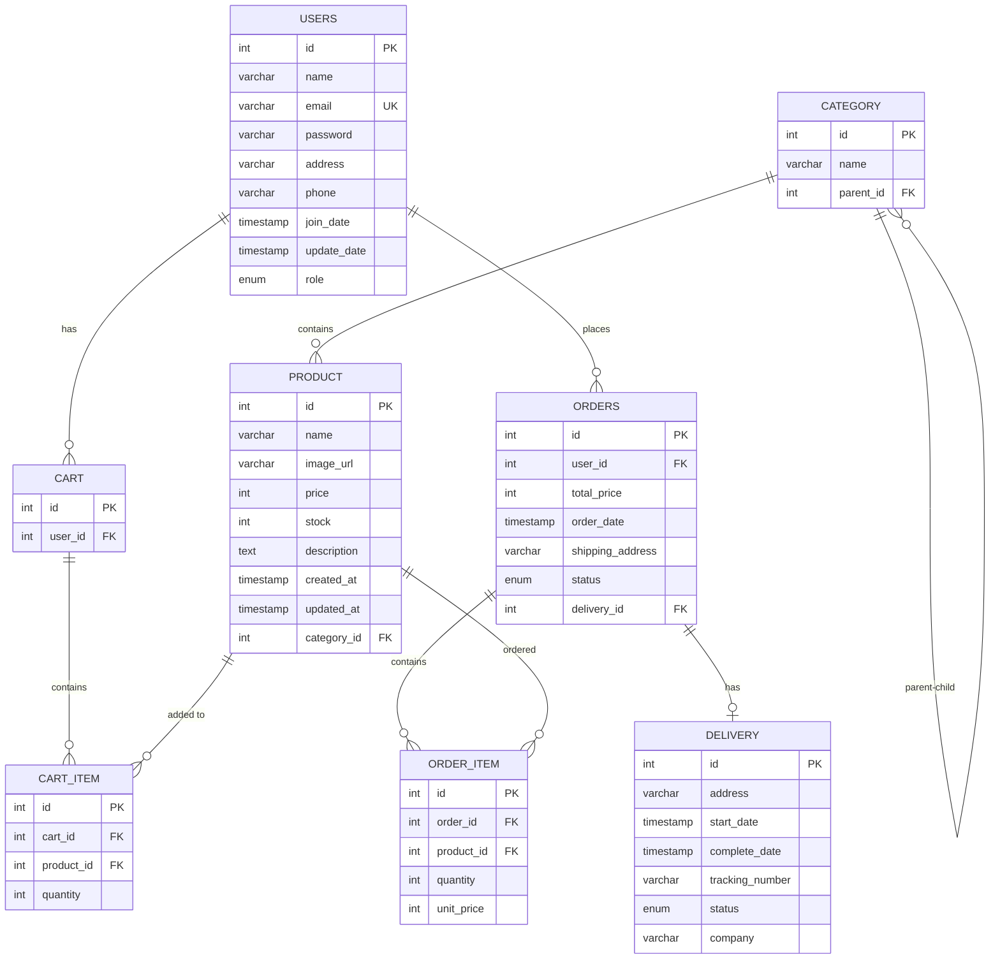
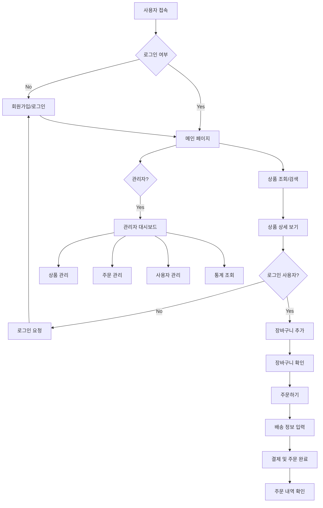
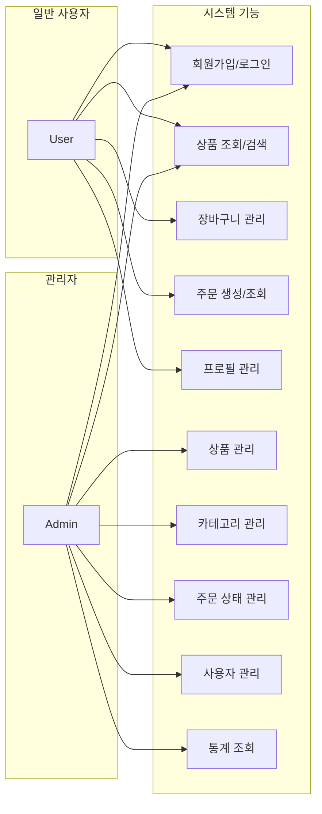
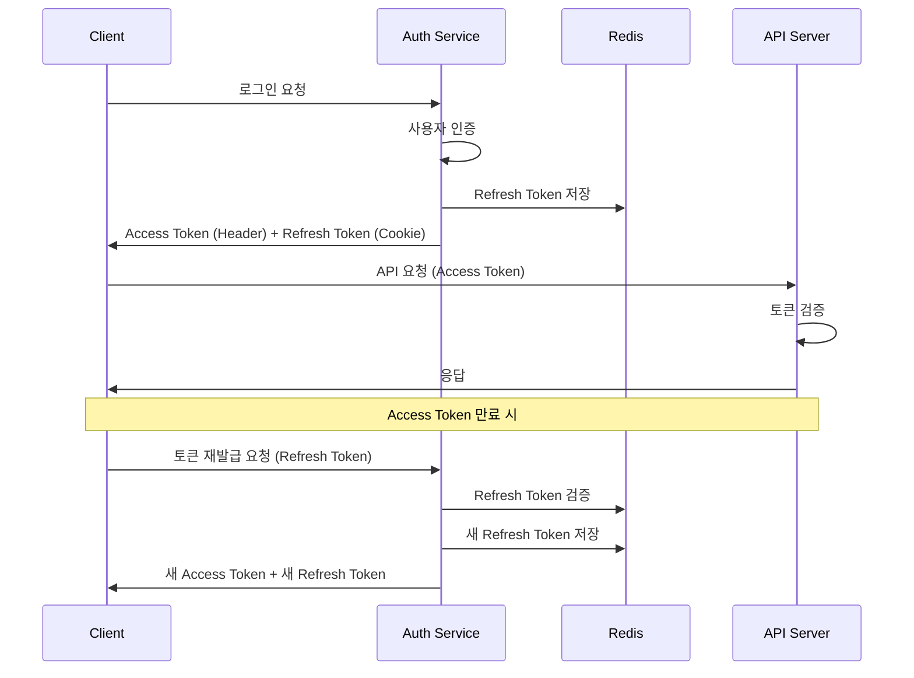

# 🌟 Team5 Vaccine - Cafe Menu Management Service

## 📋 프로젝트 개요

**Team5 Vaccine**은 프로그래머스 백엔드 데브코스 6기 8회차 1차 프로젝트로, Spring Boot 기반의 카페 메뉴 및 주문 관리 서비스입니다. 고객이 온라인으로 커피 원두를 주문하면, 하루 동안의 주문을 취합하여 다음날 배송을 진행하는 시스템을 구현했습니다.

## 🛠️ 기술 스택

### Backend (Spring Boot)
- **Framework**: Spring Boot 3.5.3
- **Language**: Java 21
- **Database**: H2 (개발), MySQL (운영 지원)
- **Cache**: Redis (토큰 저장소)
- **Security**: Spring Security + JWT
- **Documentation**: SpringDoc OpenAPI 3.x (Swagger)
- **Build Tool**: Gradle 8.14.3 (Kotlin DSL)

### Frontend (Next.js)
- **Framework**: Next.js 15.4.1
- **Language**: TypeScript
- **Styling**: Tailwind CSS 4.0
- **State Management**: Zustand
- **HTTP Client**: Axios
- **UI Components**: Radix UI, Lucide React
- **Dev Tools**: ESLint, Prettier

### DevOps & Tools
- **CI/CD**: GitHub Actions
- **API Generation**: swagger-typescript-api
- **Development**: Docker (Redis)

## 🏗️ 프로젝트 구조

### Backend 아키텍처
```
backend/src/main/java/com/back/
├── Application.java                 # 메인 애플리케이션 클래스
├── domain/                         # 도메인별 패키지
│   ├── admin/                      # 관리자 기능
│   │   ├── controller/             # 관리자 컨트롤러
│   │   ├── service/                # 관리자 서비스
│   │   └── dto/                    # 관리자 DTO
│   ├── auth/                       # 인증/인가
│   │   ├── controller/             # 인증 컨트롤러
│   │   ├── service/                # 인증 서비스
│   │   └── dto/                    # 인증 DTO
│   ├── user/                       # 사용자 관리
│   │   ├── entity/                 # 사용자 엔티티
│   │   ├── repository/             # 사용자 리포지토리
│   │   ├── service/                # 사용자 서비스
│   │   └── controller/             # 사용자 컨트롤러
│   ├── product/                    # 상품 관리
│   │   ├── entity/                 # 상품/카테고리 엔티티
│   │   ├── repository/             # 상품 리포지토리
│   │   ├── service/                # 상품 서비스
│   │   ├── controller/             # 상품 컨트롤러
│   │   └── exception/              # 상품 예외 처리
│   ├── cart/                       # 장바구니
│   │   ├── entity/                 # 장바구니 엔티티
│   │   ├── repository/             # 장바구니 리포지토리
│   │   ├── service/                # 장바구니 서비스
│   │   └── controller/             # 장바구니 컨트롤러
│   ├── order/                      # 주문 관리
│   │   ├── entity/                 # 주문 엔티티
│   │   ├── repository/             # 주문 리포지토리
│   │   ├── service/                # 주문 서비스
│   │   ├── controller/             # 주문 컨트롤러
│   │   └── exception/              # 주문 예외 처리
│   └── delivery/                   # 배송 관리
│       ├── entity/                 # 배송 엔티티
│       ├── repository/             # 배송 리포지토리
│       ├── service/                # 배송 서비스
│       └── controller/             # 배송 컨트롤러
└── global/                         # 글로벌 설정
    ├── config/                     # 설정 클래스들
    │   ├── SecurityConfig.java     # 보안 설정
    │   ├── JpaAuditingConfig.java  # JPA 감사 설정
    │   ├── RedisConfig.java        # Redis 설정
    │   └── SpringDocConfig.java    # Swagger 설정
    ├── security/                   # 보안 관련
    │   ├── jwt/                    # JWT 토큰 처리
    │   └── auth/                   # 인증 처리
    └── exception/                  # 글로벌 예외 처리
```

### Frontend 아키텍처
```
frontend/src/
├── app/                           # Next.js 13+ App Router
│   ├── layout.tsx                 # 루트 레이아웃
│   ├── page.tsx                   # 홈페이지
│   ├── login/                     # 로그인 페이지
│   ├── signup/                    # 회원가입 페이지
│   ├── shop/                      # 상품 목록 페이지
│   ├── product/[id]/              # 상품 상세 페이지
│   ├── cart/                      # 장바구니 페이지
│   ├── orders/                    # 주문 내역 페이지
│   ├── profile/                   # 프로필 페이지
│   └── admin/                     # 관리자 페이지
├── features/                      # 기능별 모듈
│   ├── auth/                      # 인증 관련
│   │   ├── components/            # 인증 컴포넌트
│   │   ├── authStore.ts           # 인증 상태 관리
│   │   └── adminAuthStore.ts      # 관리자 인증 상태
│   ├── product/                   # 상품 관련
│   │   ├── components/            # 상품 컴포넌트
│   │   ├── hooks/                 # 상품 훅
│   │   ├── api.ts                 # 상품 API
│   │   └── types.ts               # 상품 타입
│   ├── cart/                      # 장바구니 관련
│   │   ├── components/            # 장바구니 컴포넌트
│   │   ├── cartStore.ts           # 장바구니 상태 관리
│   │   └── api.ts                 # 장바구니 API
│   └── orders/                    # 주문 관련
│       ├── components/            # 주문 컴포넌트
│       ├── api.ts                 # 주문 API
│       └── types.ts               # 주문 타입
├── components/                    # 공통 컴포넌트
│   ├── ui/                        # UI 컴포넌트
│   ├── layout/                    # 레이아웃 컴포넌트
│   ├── auth/                      # 인증 관련 컴포넌트
│   ├── admin/                     # 관리자 컴포넌트
│   └── providers/                 # Context Providers
└── lib/                           # 유틸리티 및 설정
    ├── utils.ts                   # 공통 유틸리티
    └── backend/                   # 백엔드 API 클라이언트
        └── apiV1/                 # API v1 클라이언트
```
## 📊 데이터베이스 ERD





---

## 🔄 시스템 플로우차트



## 🎭 유스케이스 다이어그램




---


## 🎬 시연 영상 및 스크린샷

### 📱 **메인 기능 시연 영상**

#### 🛒 관리자 로그인 페이지
> 관리자의 로그인 페이지 입니다. 해당 페이지에서는 관리자만 로그인이 가능합니다.

#### 🔐 관리자 상품 관리
> 관리자 상품 관리 페이지입니다. 관리자는 상품을 등록, 수정, 삭제할 수 있습니다.

#### ⚙️ 관리자 카테고리 관리
> 관리자 카테고리 관리 페이지입니다. 관리자는 카테고리를 추가, 수정, 삭제할 수 있습니다.

> #### ⚙️ 관리자 주문 관리
> 관리자 주문 관리 페이지입니다. 관리자는 주문을 조회하고 상태를 변경할 수 있습니다.

> #### ⚙️ 관리자 유저 정보 수정
> 관리자 유저 정보 수정 페이지입니다. 관리자는 유저의 정보를 조회하고 수정할 수 있습니다.
> 
> #### ⚙️ 관리자 유저 정보 수정
> 변경된 유저 정보가 보입니다.

#### 🛒 상품 목록 페이지
> 상품 목록 페이지입니다. 사용자는 상품을 조회하고 장바구니에 추가할 수 있습니다.

#### 🔐 주문 상세 페이지
> 주문 상세 페이지입니다. 사용자는 주문 내역을 조회할 수 있습니다.

#### ⚙️ 메인화면
> 메인화면입니다. 사용자는 로그인 후 상품을 조회하고 장바구니에 추가할 수 있습니다.


---

### 🎯 **주요 기능별 동작 흐름**

#### 1. 🛒 주문 프로세스
```
상품 선택 → 장바구니 추가 → 수량 조절 → 주문 생성 → 결제 정보 입력 → 주문 완료
```

#### 2. 🔐 인증 프로세스  
```
회원가입 → 이메일 인증 → 로그인 → JWT 토큰 발급 → API 접근 → 토큰 갱신
```

#### 3. ⚙️ 관리자 워크플로우
```
관리자 로그인 → 대시보드 접근 → 상품/주문/사용자 관리 → 통계 확인
```


### 💡 **시연 영상 및 이미지 업로드 가이드**

#### 🎬 동영상 업로드 방법
1. **GitHub Issues/PR에 업로드**
   ```
   1. GitHub 이슈나 PR 생성
   2. .mp4, .mov, .gif 파일을 드래그 앤 드롭
   3. 생성된 링크를 README에 붙여넣기
   ```

2. **권장 동영상 사양**
   - **해상도**: 1920x1080 (Full HD) 또는 1280x720 (HD)
   - **시간**: 30초 - 2분
   - **포맷**: MP4 (H.264 코덱)
   - **용량**: 25MB 이하

#### 📷 이미지 업로드 방법
1. **GitHub Assets 활용**
   ```
   1. GitHub 이슈나 PR에 이미지 드래그 앤 드롭
   2. 생성된 URL을 README에 붙여넣기
   3. 또는 repository의 docs/images/ 폴더에 저장
   ```

2. **권장 이미지 사양**
   - **포맷**: PNG, JPG, GIF
   - **해상도**: 최대 1920px 너비
   - **용량**: 이미지당 10MB 이하
   - **네이밍**: 기능명-화면명.png (예: admin-product-management.png)

---

## 🔧 핵심 기능

### 1. 사용자 인증 및 권한 관리
- **JWT 기반 토큰 인증**: Access Token + Refresh Token
- **역할 기반 접근 제어**: USER/ADMIN 권한 분리
- **Redis 토큰 저장소**: Refresh Token 안전 관리
- **자동 토큰 갱신**: 클라이언트 측 토큰 자동 갱신

### 2. 상품 및 카테고리 관리
- **계층적 카테고리 구조**: 부모-자식 카테고리 관계
- **상품 CRUD**: 관리자 상품 등록/수정/삭제
- **상품 검색 및 필터링**: 이름, 카테고리, 가격 범위별 검색
- **재고 관리**: 실시간 재고 추적

### 3. 장바구니 시스템
- **사용자별 장바구니**: 로그인 기반 개인 장바구니
- **실시간 수량 조절**: 장바구니 내 상품 수량 변경
- **장바구니 상태 관리**: Zustand 기반 클라이언트 상태 관리

### 4. 주문 처리 시스템
- **주문 생성**: 장바구니에서 주문으로 전환
- **주문 상태 관리**: 주문 접수 → 준비 중 → 배송 중 → 완료
- **주문 내역 조회**: 사용자별 주문 기록 관리
- **일괄 주문 처리**: 스케줄러 기반 자동 주문 처리

### 5. 관리자 대시보드
- **사용자 관리**: 전체 사용자 목록 및 정보 수정
- **주문 관리**: 전체 주문 현황 및 상태 변경
- **상품 관리**: 상품 등록/수정/삭제 및 재고 관리
- **통계 조회**: 매출 통계 및 상품별 판매 통계

## 🔐 보안 구조

### JWT 토큰 인증 플로우


### 보안 기능
- **BCrypt 암호화**: 사용자 비밀번호 해싱
- **CORS 설정**: 프론트엔드-백엔드 간 안전한 통신
- **입력값 검증**: @Valid, @NotNull 등 서버 측 검증
- **SQL Injection 방지**: JPA 사용으로 안전한 쿼리 실행


### 주요 관계
- 사용자 1:1 장바구니, 1:N 주문
- 카테고리 1:N 상품 (계층 구조 지원)
- 주문 1:N 주문항목, 1:1 배송
- 상품 N:M 장바구니 (중간 테이블: CART_ITEM)

## 🚀 개발 환경 설정

### Backend 설정
```bash
# Redis 서버 실행 (Docker)
docker run -d -p 6379:6379 redis:7-alpine

# 프로젝트 클론 및 실행
git clone [repository-url]
cd backend
./gradlew bootRun
```

### Frontend 설정
```bash
cd frontend
npm install
npm run dev
```

### 환경 변수 설정
```yaml
# backend/src/main/resources/application.yml
jwt:
  secret: ${JWT_SECRET:your-secret-key}
  access-token-expiration: PT15M
  refresh-token-expiration: PT168H

spring:
  data:
    redis:
      host: localhost
      port: 6379
```

## 📡 API 명세

### 주요 API 엔드포인트
- **인증**: `/api/v1/auth/*` - 로그인, 회원가입, 토큰 관리
- **사용자**: `/api/v1/users/*` - 사용자 정보 조회/수정
- **상품**: `/api/v1/products/*` - 상품 목록, 상세, 검색
- **카테고리**: `/api/v1/categories/*` - 카테고리 목록, 계층 구조
- **장바구니**: `/api/v1/carts/*` - 장바구니 CRUD
- **주문**: `/api/v1/orders/*` - 주문 생성, 조회
- **관리자**: `/api/v1/admin/*` - 관리자 전용 기능

### API 문서
- **Swagger UI**: `http://localhost:8080/swagger-ui/index.html`
- **OpenAPI Spec**: `http://localhost:8080/v3/api-docs`

## 🎯 특징 및 차별점

### 1. 모듈형 아키텍처
- **도메인 주도 설계**: 각 도메인별로 독립적인 패키지 구조
- **계층 분리**: Controller, Service, Repository 계층 명확 분리
- **의존성 관리**: Spring의 IoC 컨테이너 활용

### 2. 현대적 프론트엔드
- **Next.js 13+ App Router**: 최신 React 기능 활용
- **TypeScript**: 타입 안정성 확보
- **Zustand**: 가벼운 상태 관리
- **자동 API 생성**: Swagger 스펙에서 TypeScript API 클라이언트 자동 생성

### 3. DevOps 친화적
- **CI/CD Pipeline**: GitHub Actions 기반 자동화
- **컨테이너화**: Docker 지원
- **환경별 설정**: dev, test, prod 환경 분리

### 4. 확장 가능한 설계
- **Redis 캐싱**: 성능 최적화 및 확장성
- **JWT 토큰**: Stateless 인증으로 수평 확장 가능
- **JPA 관계 매핑**: 복잡한 비즈니스 로직 지원

## 👥 팀 구성 및 역할

| 이름 | 역할 | 담당 업무 |
|------|------|-----------|
| **김달원** | Backend Developer | 장바구니 ,  배달 , Admin  통합 API  구현 |
| **김선우** | Backend Developer | User  주문 도메인 구현 , Admin  주문 도메인 구현 |
| **박영진** | Frontend Developer | 전체 UI  디자인 ,  관리자 페이지 제작 , PPT  작성 |
| **박영빈** | PM/Full-stack | GitHub  프로젝트 관리 ,  사용자 페이지 제작 ,  인증/ 인가 로직 |
| **진민호** | Backend Developer | 상품 CRUD, 재고관리, 카테고리 관리,  상품 검색/ 필터링 기능|

## 🔄 개발 프로세스

### Git Flow 전략
1. **main**: 운영 브랜치
2. **dev**: 개발 통합 브랜치
3. **feature/기능명**: 기능 개발 브랜치
4. **bugfix/버그명**: 버그 수정 브랜치

### 커밋 컨벤션
- `feat`: 새로운 기능 추가
- `fix`: 버그 수정
- `refactor`: 코드 리팩토링
- `docs`: 문서 수정
- `test`: 테스트 코드
- `chore`: 환경 설정 등

### 코드 리뷰 프로세스
1. 이슈 생성 → 브랜치 생성 → 개발 → PR 생성 → 코드 리뷰 → Merge

## 🧪 테스트 전략

### Backend 테스트
- **단위 테스트**: Service 계층 로직 테스트
- **통합 테스트**: Controller API 테스트
- **Repository 테스트**: JPA 쿼리 테스트

### Frontend 테스트
- **컴포넌트 테스트**: React 컴포넌트 단위 테스트
- **E2E 테스트**: 사용자 시나리오 테스트

## 📈 성능 최적화

### Backend 최적화
- **JPA 지연 로딩**: N+1 문제 방지
- **Redis 캐싱**: 토큰 및 세션 관리
- **Connection Pooling**: HikariCP 사용
- **쿼리 최적화**: Fetch Join 활용

### Frontend 최적화
- **Next.js 최적화**: 이미지 최적화, 코드 스플리팅
- **상태 관리**: Zustand로 불필요한 리렌더링 방지
- **API 캐싱**: React Query (TanStack Query) 활용

## 📝 라이선스

이 프로젝트는 교육 목적으로 개발되었으며, 프로그래머스 백엔드 데브코스 6기의 일환입니다.

---

**Grids & Circles Cafe Management Service** - 팀5 백신 💉

> 현대적이고 확장 가능한 카페 주문 관리 시스템을 통해 더 나은 고객 경험을 제공합니다.
