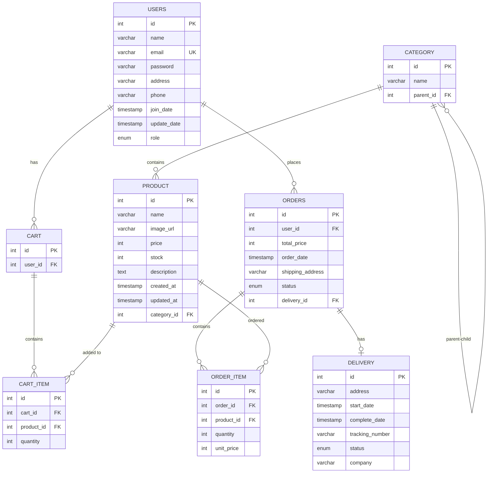
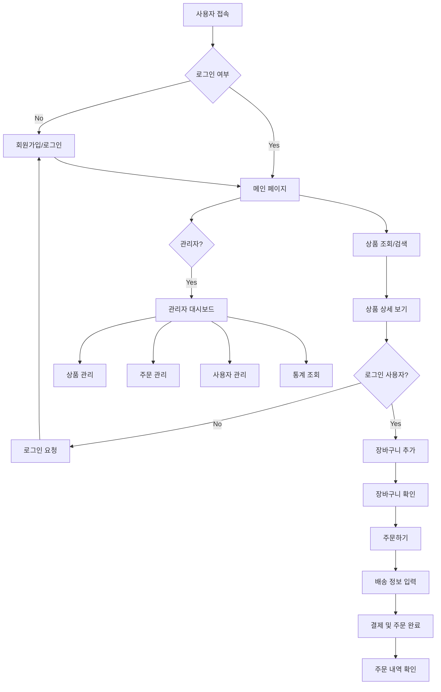
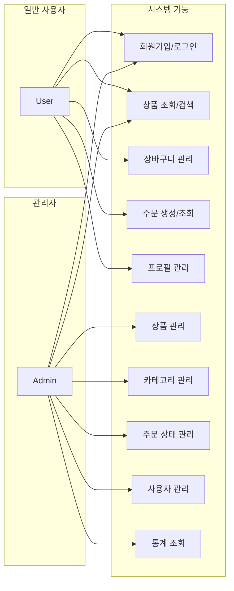
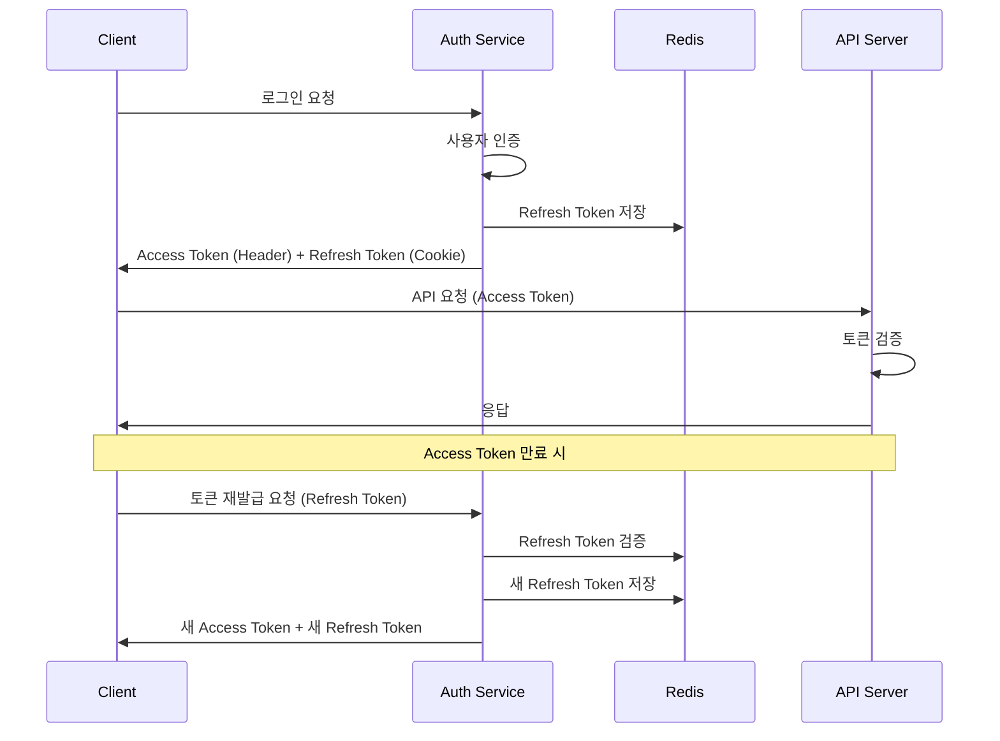

# team5-vaccine
프로그래머스 백엔드 데브코스 6기 8회차 1차 프로젝트

## **☕ Cafe Menu Management Service**
> **Spring Boot 기본의 카페 메뉴 및 주문 관리 서비스**  
> 고객이 온라인으로 커피 원두를 주문하면, 하루 동안의 주문을 취합하여 다음날 배송을 진행하는 시스템입니다.

---

## 📌 **목차**
- [🎬 프로젝트 소개](#-프로젝트-소개)
- [👯 팀원 소개](#-팀원-소개)
- [🛠 기술 스택](#-기술-스택)
- [🎯 주요 기능](#-주요-기능)
- [🛠️ 프로젝트 아키텍처](#️-프로젝트-아키텍처)
- [📊 데이터베이스 ERD](#-데이터베이스-erd)
- [🔄 시스템 플로우차트](#-시스템-플로우차트)
- [🎭 유스케이스 다이어그램](#-유스케이스-다이어그램)
- [📡 API 명세서](#-api-명세서)
- [🔒 보안 구조](#-보안-구조)
- [💻 화면 구성](#-화면-구성)
- [🚀 시작하기](#-시작하기)
- [📈 성능 최적화](#-성능-최적화)
- [🧪 테스트](#-테스트)
- [📋 개발 가이드라인](#-개발-가이드라인)
- [👯 협업 방식](#-협업-방식)

---

## 🎬 **프로젝트 소개**
> **로컬 카페의 온라인 주문 시스템**
- 고객이 **커피 원두 상품**을 온라인에서 주문할 수 있습니다.
- 하루 동안의 주문을 **오후 2시 기준으로** 다음날 일괄 배송합니다.
- **로그인** 및 회원가입과 더불어 // **비회원** 주문 기능을 제공합니다. // ????
  
---

## 👯 **팀원 소개**

<table>
  <tr>
    <td align="center">
      <a href="https://github.com/Woongbin06"></a><br/>
      <a href="https://github.com/Woongbin06"><b>김달원</b></a>
    </td>
    <td align="center">
      <a href="https://github.com/huipadyam"></a><br/>
      <a href="https://github.com/huipadyam"><b>김선우</b></a>
    </td>
    <td align="center">
      <a href="https://github.com/xaxeon"></a><br/>
      <a href="https://github.com/xaxeon"><b>박영진</b></a>
    </td>
    <td align="center">
      <a href="https://github.com/csjsseo"></a><br/>
      <a href="https://github.com/csjsseo"><b>박영빈</b></a>
    </td>
    <td align="center">
      <a href="https://github.com/Hanjise0ng"></a><br/>
      <a href="https://github.com/Hanjise0ng"><b>진민호</b></a>
    </td>
  </tr>
  <tr>
    <td align="center">Backend</td>
    <td align="center">Backend</td>
    <td align="center">Frontend</td>
    <td align="center">PM/Backend/Frontend</td>
    <td align="center">Backend</td>
  </tr>
</table>

## 👬 역할 분담 (현재 예시입니다) 

| 이름   | 담당 기능 |
|--------|-----------|
| **달원** | - 주문 생성 기능 구현<br>- 주문 관련 스케줄러 설정<br>- 예외 처리 로직 구현 |
| **선우** | - 주문 상세 조회 기능 구현<br>- 주문 수정 및 취소 기능 구현<br>- Spring Security를 통한 인증/인가 적용 |
| **영진** | - 사용자 주문 내역 조회 기능 구현<br>- 전반적인 코드 리팩토링<br>- 프론트엔드 UI 통합 작업 |
| **영빈** | - 상품 등록 및 수정 기능 구현<br>- 상품 상세 조회 기능 구현<br>- 상품 삭제 기능 구현 |
| **민호** | - 관리자 페이지 주문 내역 조회 기능 구현<br>- 상품 목록 조회 및 검색 기능 구현 |

---

## 🛠️ 기술 스택


### **Backend Framework**
- **Spring Boot** 3.5.3
- **Java** 21
- **Spring Security** 6.x
- **Spring Data JPA** 3.x
- **Spring Validation**


### **Database**
- **H2 Database** (개발 환경)
- **MySQL** (운영 환경 지원)
- **Redis** (토큰 저장소)


### **Build Tool**
- **Gradle** 8.14.3 (Kotlin DSL)


### **Documentation**
- **SpringDoc OpenAPI** 3.x (Swagger)


### **Security**
- **JWT** (JSON Web Token) - JJWT 0.11.5
- **BCrypt** 암호화


### **기타 라이브러리**
- **Lombok** (코드 간소화)
- **Jackson** (JSON 처리)
- **Logback** (로깅)


---

## 🎯 **주요 기능**

### **1. 사용자 관리 (User Management)**
- ✅ 회원가입 및 로그인
- ✅ JWT 기반 인증/인가
- ✅ 사용자 프로필 관리
- ✅ 비밀번호 변경
- ✅ 역할 기반 접근 제어 (USER/ADMIN)


### **2. 상품 관리 (Product Management)**
- ✅ 상품 CRUD (관리자)
- ✅ 카테고리 계층 구조 관리
- ✅ 상품 검색 및 필터링
- ✅ 재고 관리
- ✅ 가격별/카테고리별 조회


### **3. 장바구니 (Shopping Cart)**
- ✅ 장바구니 상품 추가/수정/삭제
- ✅ 장바구니 조회
- ✅ 장바구니 비우기
- ✅ 사용자별 장바구니 관리


### **4. 주문 관리 (Order Management)**
- ✅ 주문 생성
- ✅ 주문 내역 조회
- ✅ 주문 상태 관리 (관리자)
- ✅ 주문 상세 정보 조회


### **5. 배송 관리 (Delivery Management)**
- ✅ 배송 정보 관리
- ✅ 배송 상태 추적
- ✅ 배송 업체 관리


### **6. 관리자 기능 (Admin Features)**
- ✅ 사용자 관리 (페이지네이션, 검색)
- ✅ 매출 통계 조회
- ✅ 상품별 판매 통계
- ✅ 재고 부족 상품 알림

---

### ⏱️ 주문 일괄 처리

- `@Scheduled` 어노테이션을 활용하여 **주문 상태를 일괄적으로 처리**하는 기능 구현
- 전날 오후 2시부터 당일 오후 2시까지의 주문 처리가 특정 시간마다 예약 실행되어 주문 처리 자동화

---

## 🛠️ 프로젝트 아키텍쳐

## 📊 데이터베이스 ERD





---


## 🔄 시스템 플로우차트



## 🎭 유스케이스 다이어그램





---
## 📡 API 명세서


### **🔐 Authentication API**


| Method | Endpoint | Description | Auth Required |
|--------|----------|-------------|---------------|
| POST | `/api/v1/auth/signup` | 회원가입 | ❌ |
| POST | `/api/v1/auth/login` | 로그인 | ❌ |
| POST | `/api/v1/auth/logout` | 로그아웃 | ✅ |
| POST | `/api/v1/auth/reissue` | 토큰 재발급 | ❌ |
| POST | `/api/v1/auth/change-password` | 비밀번호 변경 | ✅ |


### **👤 User API**


| Method | Endpoint | Description | Auth Required |
|--------|----------|-------------|---------------|
| GET | `/api/v1/users/me` | 내 정보 조회 | ✅ USER |
| PUT | `/api/v1/users/me` | 내 정보 수정 | ✅ USER |


### **🛍️ Product API**


| Method | Endpoint | Description | Auth Required |
|--------|----------|-------------|---------------|
| GET | `/api/v1/products` | 전체 상품 목록 조회 | ❌ |
| GET | `/api/v1/products/{id}` | 특정 상품 조회 | ❌ |
| GET | `/api/v1/products/search` | 상품 검색 (GET) | ❌ |
| POST | `/api/v1/products/search` | 상품 검색 (POST) | ❌ |
| GET | `/api/v1/products/search/name` | 상품명으로 검색 | ❌ |
| GET | `/api/v1/products/category/{categoryId}` | 카테고리별 상품 조회 | ❌ |
| GET | `/api/v1/products/price-range` | 가격 범위별 상품 조회 | ❌ |
| GET | `/api/v1/products/out-of-stock` | 품절 상품 조회 | ❌ |


### **📁 Category API**


| Method | Endpoint | Description | Auth Required |
|--------|----------|-------------|---------------|
| GET | `/api/v1/categories` | 전체 카테고리 목록 조회 | ❌ |
| GET | `/api/v1/categories/{id}` | 특정 카테고리 조회 | ❌ |
| GET | `/api/v1/categories/roots` | 루트 카테고리 조회 | ❌ |


### **🛒 Cart API**


| Method | Endpoint | Description | Auth Required |
|--------|----------|-------------|---------------|
| GET | `/api/v1/carts` | 장바구니 조회 | ✅ USER |
| POST | `/api/v1/carts/items` | 장바구니에 상품 추가 | ✅ USER |
| PUT | `/api/v1/carts/items/{cartItemId}` | 장바구니 항목 수량 수정 | ✅ USER |
| DELETE | `/api/v1/carts/items/{cartItemId}` | 장바구니 항목 삭제 | ✅ USER |
| DELETE | `/api/v1/carts` | 장바구니 비우기 | ✅ USER |


### **📦 Order API**


| Method | Endpoint | Description | Auth Required |
|--------|----------|-------------|---------------|
| POST | `/api/v1/orders` | 주문 생성 | ✅ USER |
| GET | `/api/v1/orders` | 내 주문 목록 조회 | ✅ USER |
| GET | `/api/v1/orders/{orderId}` | 주문 상세 조회 | ✅ USER |
| GET | `/api/v1/orders/admin/all` | 전체 주문 목록 조회 | ✅ ADMIN |
| PATCH | `/api/v1/orders/admin/{orderId}/status` | 주문 상태 변경 | ✅ ADMIN |


### **⚙️ Admin API**


| Method | Endpoint | Description | Auth Required |
|--------|----------|-------------|---------------|
| GET | `/api/v1/admin/users` | 사용자 목록 조회 (페이지네이션) | ✅ ADMIN |
| GET | `/api/v1/admin/users/{userId}` | 특정 사용자 정보 조회 | ✅ ADMIN |
| PUT | `/api/v1/admin/users/{userId}` | 사용자 정보 수정 | ✅ ADMIN |
| GET | `/api/v1/admin/statistics/sales` | 판매 통계 조회 | ✅ ADMIN |
| GET | `/api/v1/admin/statistics/products` | 상품별 판매 통계 | ✅ ADMIN |


### **🛍️ Admin Product API**


| Method | Endpoint | Description | Auth Required |
|--------|----------|-------------|---------------|
| POST | `/api/v1/admin/products` | 상품 생성 | ✅ ADMIN |
| PUT | `/api/v1/admin/products/{id}` | 상품 정보 수정 | ✅ ADMIN |
| DELETE | `/api/v1/admin/products/{id}` | 상품 삭제 | ✅ ADMIN |
| GET | `/api/v1/admin/products/low-stock` | 재고 부족 상품 조회 | ✅ ADMIN |


### **📁 Admin Category API**


| Method | Endpoint | Description | Auth Required |
|--------|----------|-------------|---------------|
| POST | `/api/v1/admin/categories` | 카테고리 생성 | ✅ ADMIN |
| PUT | `/api/v1/admin/categories/{id}` | 카테고리 정보 수정 | ✅ ADMIN |
| DELETE | `/api/v1/admin/categories/{id}` | 카테고리 삭제 | ✅ ADMIN |


---
## 🔒 보안 구조


### **JWT 토큰 기반 인증**



### 🔐 **권한 체계**
- **USER**: 일반 사용자 권한
 - 상품 조회, 장바구니 관리, 주문 생성/조회, 프로필 관리
- **ADMIN**: 관리자 권한
 - 모든 USER 권한 + 상품/카테고리/주문/사용자 관리, 통계 조회


---


## 💻 화면 구성
#### 주문 생성 및 사용자 주문 관리


#### 상품 관리


#### 주문 관리


---


## 🚀 시작하기


### **개발 환경 설정**


1. **필수 요구사항**
  - Java 21+
  - Redis Server
  - IDE (IntelliJ IDEA 권장)


2. **프로젝트 실행**
  ```bash
  # 리포지토리 클론
  git clone [repository-url]
  cd backend
 
  # Redis 서버 실행 (별도 터미널)
  redis-server
 
  # 애플리케이션 실행
  ./gradlew bootRun
  ```


3. **접속 정보**
  - API 서버: `http://localhost:8080`
  - Swagger UI: `http://localhost:8080/swagger-ui/index.html`
  - H2 Console: `http://localhost:8080/h2-console`


### **환경별 설정**
- **개발**: `application-dev.yml` (H2 Database)
- **테스트**: `application-test.yml`
- **운영**: `application-prod.yml` (MySQL)


---


## 📈 성능 최적화


### **구현된 최적화**
- **지연 로딩 (Lazy Loading)**: 엔티티 연관관계 최적화
- **JPA Auditing**: 생성/수정 시간 자동 관리
- **Redis 캐싱**: 토큰 저장 및 세션 관리
- **Connection Pooling**: HikariCP 사용


### **권장 사항**
- **쿼리 최적화**: N+1 문제 해결을 위한 Fetch Join 적용
- **페이지네이션**: 대용량 데이터 조회 시 적용
- **캐싱 전략**: 자주 조회되는 상품 데이터 캐싱


---


## 🧪 테스트


### **테스트 실행**
```bash
# 전체 테스트 실행
./gradlew test


# 특정 테스트 클래스 실행
./gradlew test --tests "ProductServiceTest"
```


### **테스트 구조**
- **단위 테스트**: Service 계층 테스트
- **통합 테스트**: Controller 계층 테스트
- **데이터베이스 테스트**: Repository 계층 테스트


---


## 📋 개발 가이드라인


### **코딩 컨벤션**
- **Java**: Google Java Style Guide 준수
- **패키지명**: 소문자, 도메인별 분리
- **클래스명**: PascalCase
- **메서드명**: camelCase


### **API 설계 원칙**
- **RESTful**: HTTP 메서드와 상태코드 적절히 사용
- **버전 관리**: URL 경로에 `/api/v1/` 포함
- **에러 응답**: 일관된 에러 응답 형식
- **문서화**: Swagger 어노테이션 필수


### **보안 가이드라인**
- **인증**: JWT 토큰 기반 인증 사용
- **인가**: 메서드 레벨 보안 적용
- **검증**: 입력값 검증 (@Valid, @NotNull 등)
- **암호화**: BCrypt를 사용한 비밀번호 해싱


## 👏 협업 방식
### 🛠️ 브랜치 전략

1. **이슈 생성**
    - GitHub 이슈를 통해 작업 항목 정의

2. **브랜치 생성**
    - `dev` 브랜치에서 이슈별 작업 브랜치 생성
    - 브랜치 명명 규칙 예시: `be/feature/auth-login` , 'be/bugfix/db-connection-error', 'fe/refactor/header-style'
    
3. **커밋 메시지**
  - `feat` 새로운 기능 추가(테스트도 같이 TDD)
  - `fix` 버그 수정
  - `refactor` 기능 변경 없이 코드 구조 개선

  - `fe` 프론트엔드
  - `be` 백엔
    
  - `test` 테스트 코드 변경
  - `docs` 문서 관련 변경 (README, 주석, 가이드 등)
  - `chore` 환경 설정 등등 기타

4. **PR 및 코드 리뷰**
    - 작업 완료 후 Pull Request(PR) 생성
    - 팀원 간 코드 리뷰 진행

5. **Merge 및 브랜치 정리**
    - 리뷰 완료 후 `dev` 브랜치로 Merge
    - Merge 후 이슈 브랜치 삭제
    - `dev` 브랜치 최신 상태 유지

---

